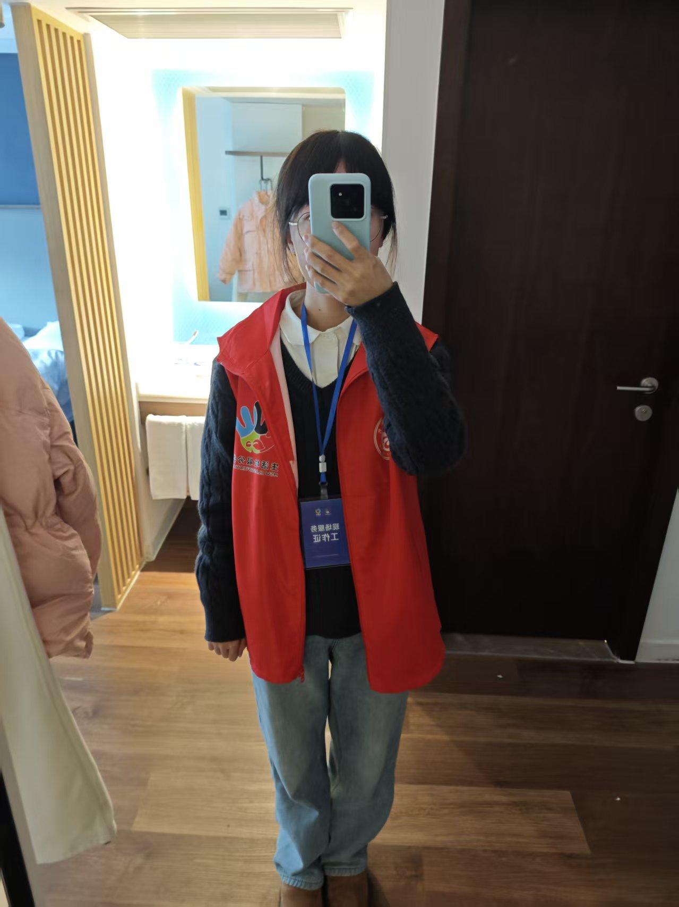
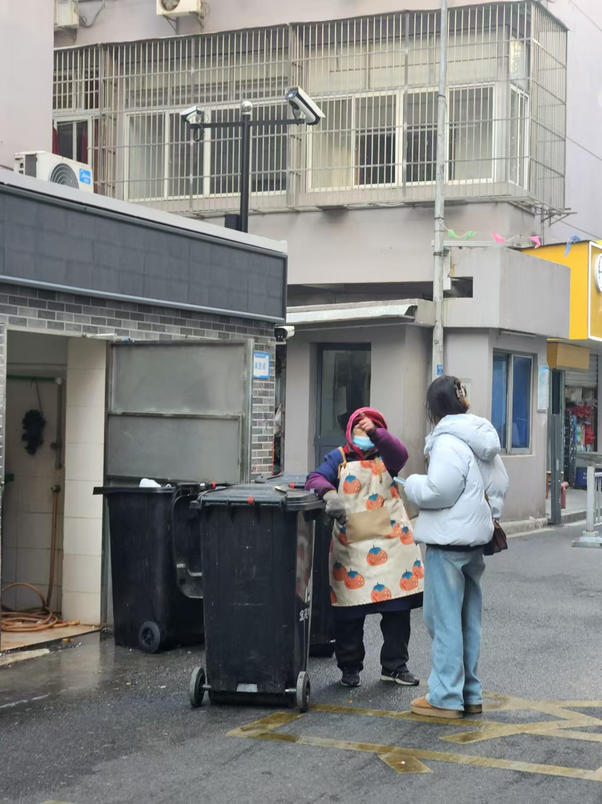
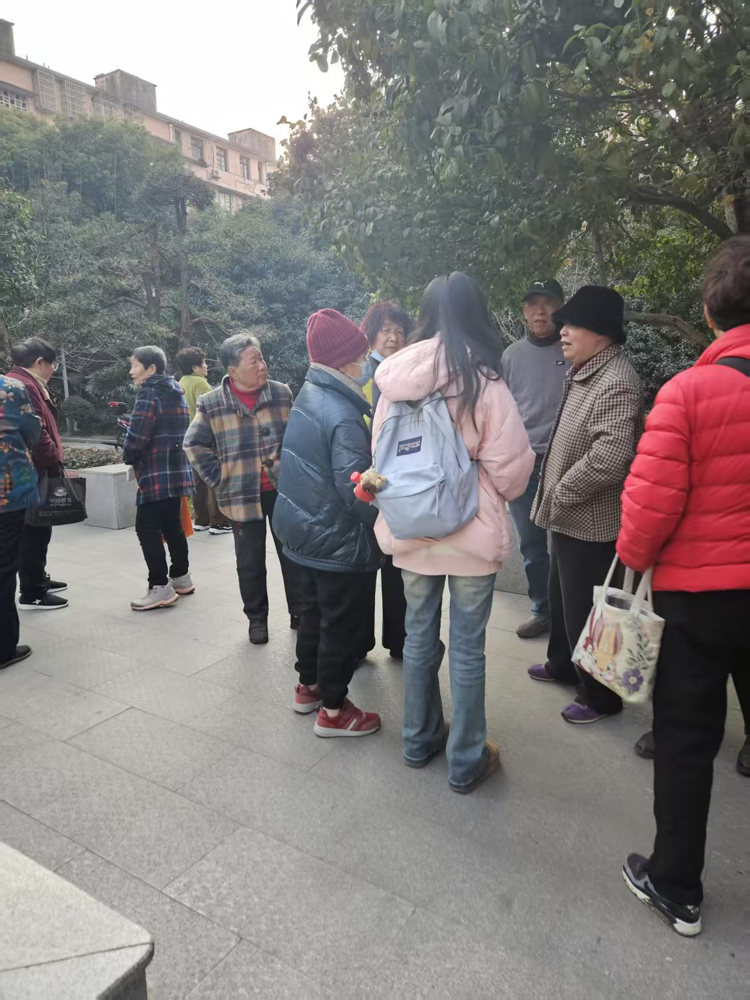

In January 2025, I visited residential communities in Ningbo to understand how the recycling program operated in practice. I interviewed community staff, property-management personnel, residents, smart-bin supervisors, and collection drivers.

Seeing the system in use helped me understand how the data were generated and led me to consider how access might shape participation.

::: {layout-ncol=3}
{fig-alt="Preparing for the community visits"}

{fig-alt="Interviewing a staff member responsible for the community's waste collection facilities"}

{fig-alt="Interviewing residents in a neighborhood"}
:::
