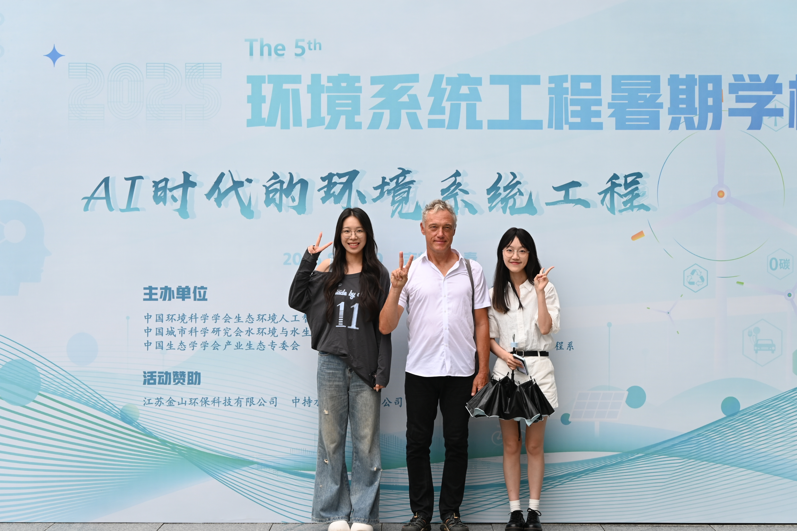

The six-day program at Northeast Normal University focused on AI-driven environmental innovation and brought together more than 80 participants in nine teams. I received the Outstanding Participant award.

{fig-alt="At the 5th Environmental Systems Engineering Summer School" width=100% fig-align="center"}
